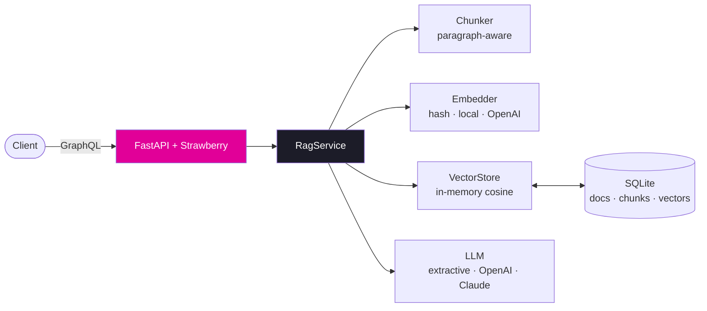

<div align="center">

<h1>⚡ GraphSearch</h1>

<p><strong>Ask questions. Get grounded answers. One GraphQL endpoint.</strong></p>

<p>Turn any pile of documents — PDFs, Markdown, plain text — into a typed,<br>
introspectable Q&amp;A API. Zero API keys, zero infrastructure to start.</p>

[](https://github.com/mohithgowdak/graphsearch/actions/workflows/ci.yml)
[](https://pypi.org/project/graphsearch-rag/)
[](https://pypi.org/project/graphsearch-rag/)
[](https://github.com/mohithgowdak/graphsearch/pkgs/container/graphsearch)
[](LICENSE)

<p>
<a href="#-quickstart">Quickstart</a> ·
<a href="#-the-playground">Playground</a> ·
<a href="#-graphql-api">API</a> ·
<a href="#-architecture">Architecture</a> ·
<a href="#-roadmap--good-first-issues">Roadmap</a> ·
<a href="#-contributing">Contributing</a>
</p>


<p><em>"How do I get my money back?" finds the returns policy — no shared keywords, no API keys.</em></p>

</div>

---

## ✨ Why GraphSearch?

|  |  |
|---|---|
| 🔍 **Semantic search, zero keys** | Ships with offline embeddings — `pip install` and ask questions. Add sentence-transformers for real semantic retrieval, still 100% local. |
| 📎 **Grounded, cited answers** | Answers cite their sources as `[1]`, `[2]`, … mapping 1:1 to returned chunks with relevance scores. No hallucination hand-waving. |
| 📄 **PDFs welcome** | Drop PDF / Markdown / text files into the Playground, the `uploadFile` mutation, or the CLI — text extraction is built in. |
| 🧬 **One typed endpoint** | GraphQL means clients fetch exactly the fields they need, with introspection, GraphiQL, and a generated [TypeScript client](clients/typescript) that fails CI if it drifts from the schema. |
| 🔌 **Pluggable everything** | Embedder, vector store, and LLM are clean interfaces. Swap OpenAI ↔ Claude ↔ offline modes with one env var. |
| 🪶 **No infrastructure** | SQLite + numpy under the hood. No vector DB cluster, no queue, no Redis — until *you* decide you need one. |

## 🚀 Quickstart

```bash
pip install graphsearch-rag        # imports as `graphsearch`
```

```bash
graphsearch-ingest data/example_docs   # or your own .pdf / .md / .txt
graphsearch                            # → http://localhost:8000
```

That's it — no API keys, no services, no config. Prefer containers?

```bash
docker run -p 8000:8000 ghcr.io/mohithgowdak/graphsearch:latest
```

> **`graphsearch` not recognized?** With `pip install --user` (Windows default
> when site-packages isn't writable), pip's Scripts folder may not be on PATH.
> Skip PATH entirely:
>
> ```bash
> python -m graphsearch                            # start the server
> python -m graphsearch.ingest data/example_docs   # ingest documents
> ```

## 🎮 The Playground

Open **http://localhost:8000/** and test RAG **with your own documents** before
writing a line of client code — paste text or drop files, ask questions, inspect
ranked sources. Every action has a **"Show the GraphQL"** toggle revealing the
exact query it runs, ready to copy into your app.

<div align="center">

</div>

Prefer raw GraphQL? **GraphiQL** lives at http://localhost:8000/graphql.

## 🎚 Level up the pipeline

The default mode is fully offline (hashing-trick embeddings + extractive
answers) so the whole pipeline runs anywhere, including CI. Upgrade each stage
independently:

**Real semantic search — still no API key** (sentence-transformers, ~80 MB model, CPU):

```bash
pip install "graphsearch-rag[local]"
export GRAPHSEARCH_EMBEDDINGS=local    # $env:GRAPHSEARCH_EMBEDDINGS='local' on Windows
graphsearch-ingest data/example_docs   # re-ingest: embeddings are created at ingest time
graphsearch
```

**LLM-generated answers with citations** (OpenAI or Anthropic):

```bash
pip install "graphsearch-rag[anthropic]"   # or [openai]
export GRAPHSEARCH_LLM=anthropic           # or openai
export ANTHROPIC_API_KEY=sk-ant-...
graphsearch
```

| Setting | Options | Default |
|---|---|---|
| `GRAPHSEARCH_EMBEDDINGS` | `hash` (offline) · `local` (offline, semantic) · `openai` | `hash` |
| `GRAPHSEARCH_LLM` | `extractive` (offline) · `openai` · `anthropic` | `extractive` |

> Documents are embedded at ingest time — re-ingest after switching embedding backends.
> Full configuration reference: [.env.example](.env.example)

## 🧩 GraphQL API

```graphql
# Queries
answer(question: String!, topK: Int): Answer!      # RAG: retrieve + generate, with cited sources
search(query: String!, topK: Int): [Chunk!]!       # raw semantic search
documents(limit: Int = 20, offset: Int = 0): [Document!]!
document(id: ID!): Document

# Mutations
uploadDocument(content: String!, title: String, source: String): Document!
uploadFile(file: Upload!, title: String, source: String): Document!    # PDF/Markdown/text
deleteDocument(id: ID!): Boolean!
```

<details>
<summary><strong>Example: ingest and ask in one session</strong></summary>

```graphql
mutation {
  uploadDocument(
    content: "Support hours are 9am-5pm PST, Monday through Friday."
    title: "support-hours"
  ) { id chunkCount }
}

query {
  answer(question: "When is support available?") {
    text                                 # cites sources as [1], [2], ...
    sources { documentTitle text score }
  }
}
```

</details>

<details>
<summary><strong>File uploads (multipart)</strong></summary>

`uploadFile` follows the [GraphQL multipart request spec](https://github.com/jaydenseric/graphql-multipart-request-spec).
PDF text extraction happens server-side via pypdf — scanned/image-only PDFs are
rejected with a hint to OCR them first, encrypted PDFs with a hint to decrypt.

</details>

**TypeScript?** [`clients/typescript`](clients/typescript) ships a fully-typed
SDK generated straight from this schema — `client.Answer({ question })`,
`client.Search(...)`, etc. CI regenerates it on every push and fails the build
if it drifts from the server.

## 🏗 Architecture



Every pipeline stage is an abstract interface (`Embedder`, `VectorStore`, `LLM`) —
new backends are drop-in additions, and several are up for grabs as
[good first issues](https://github.com/mohithgowdak/graphsearch/issues).

## 🛠 Development

```bash
git clone https://github.com/mohithgowdak/graphsearch && cd graphsearch
pip install -e ".[dev]"
ruff check .          # lint
pytest -v             # 33 tests, all fully offline
```

## 🗺 Roadmap / good first issues

- [ ] Vector store backends: Qdrant, Weaviate, Redis/Valkey, pgvector, FAISS
- [ ] Embedding backends: Cohere, Voyage
- [ ] Streaming answers via GraphQL subscriptions
- [ ] Metadata tags + filters; hybrid keyword+vector search (SQLite FTS5)
- [ ] Auth (API keys / JWT) and rate limiting
- [ ] Query/embedding caching
- [x] Auto-generated TypeScript client — see [`clients/typescript`](clients/typescript)
- [ ] Evaluation harness + Prometheus metrics
- [ ] Advanced RAG: query rewriting, multi-hop retrieval, citation spans

Most of these are filed with implementation notes —
[grab one](https://github.com/mohithgowdak/graphsearch/issues) 👋

## 🤝 Contributing

Contributions are very welcome! [CONTRIBUTING.md](CONTRIBUTING.md) covers setup,
the backend-authoring guide, and PR guidelines. Look for the
[`good first issue`](https://github.com/mohithgowdak/graphsearch/issues?q=is%3Aissue+is%3Aopen+label%3A%22good+first+issue%22)
label to get started.

## 📄 License

[MIT](LICENSE) — do whatever you want, just keep the notice.

---

<div align="center">
<sub>If GraphSearch saved you from wiring up a RAG pipeline by hand, consider giving it a ⭐ — it helps others find it.</sub>
</div>
