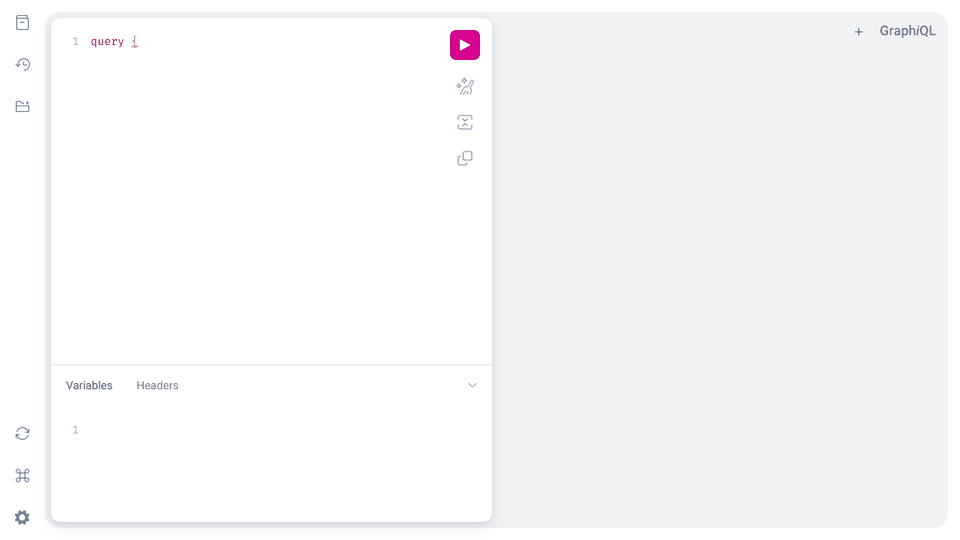
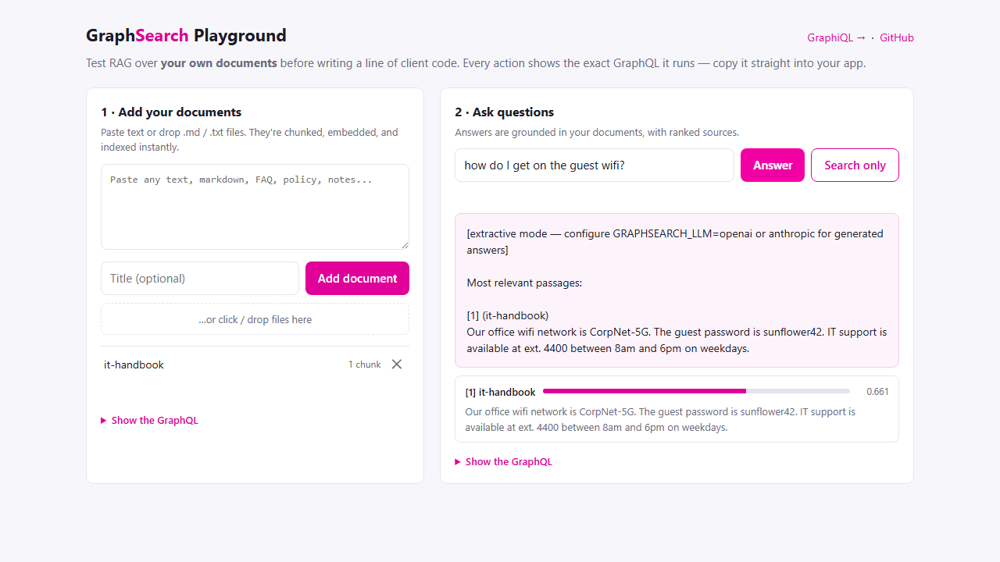

# GraphSearch

[](https://github.com/mohithgowdak/graphsearch/actions/workflows/ci.yml)
[](LICENSE)
[](pyproject.toml)

**A GraphQL API server for Retrieval-Augmented Generation (RAG) over your documents.**

Upload documents through a GraphQL mutation, then ask questions through a GraphQL query.
GraphSearch chunks and embeds your documents, retrieves the most relevant passages with
vector similarity search, and feeds them to an LLM to generate a grounded answer — all
behind a single, typed, introspectable GraphQL endpoint.

```graphql
query {
  answer(question: "How do I reset my password?") {
    text                                # cites sources as [1], [2], ...
    sources { documentTitle text score }
  }
}
```



*Semantic retrieval with the offline `local` backend: "How do I get my money back?" finds the returns policy — no shared keywords needed.*

## Why GraphQL for RAG?

- **One endpoint, typed schema** — clients ask for exactly the fields they need
  (answer text, source chunks, scores) instead of juggling REST routes.
- **Introspection & tooling for free** — GraphiQL, codegen'd TypeScript clients,
  and schema docs come with the ecosystem.
- **Composable** — `answer`, `search`, and document management live in one schema
  and can be combined in a single request.

## Quickstart

### Install

```bash
pip install graphsearch-rag        # from PyPI (imports as `graphsearch`)
# or run the prebuilt image:
docker run -p 8000:8000 ghcr.io/mohithgowdak/graphsearch:latest
# or from source:
git clone https://github.com/mohithgowdak/graphsearch && cd graphsearch
pip install -e ".[dev]"
```

### Run locally (no API keys needed)

The default configuration is fully offline: a hashing-trick embedder plus an
extractive answer mode. It exercises the entire pipeline and is perfect for
kicking the tires, tests, and CI.

```bash
# Ingest some documents (bundled examples shown; .pdf/.md/.txt all work)
graphsearch-ingest data/example_docs

# Start the server
graphsearch
```

Then open:

- **http://localhost:8000/** — the **Playground**: drop in your own documents
  (PDF, Markdown, plain text) and ask questions from the browser, no GraphQL
  knowledge needed. Every action has a "Show the GraphQL" toggle revealing the
  exact query it runs, so you can copy it straight into your app.
- **http://localhost:8000/graphql** — GraphiQL, for writing queries by hand:

```graphql
query {
  answer(question: "What is the return policy?") {
    text
    sources { text score }
  }
}
```



### Run with Docker

```bash
docker compose up --build
```

### Semantic search without any API key

The `local` backend runs [sentence-transformers](https://www.sbert.net/)
on your CPU — real semantic retrieval ("How do I get my money back?" finds
the refund policy), still zero keys and zero external services:

```bash
pip install -e ".[local]"
export GRAPHSEARCH_EMBEDDINGS=local   # $env:GRAPHSEARCH_EMBEDDINGS='local' on Windows
graphsearch-ingest data/example_docs  # re-ingest: embeddings are created at ingest time
graphsearch
```

The default model (`all-MiniLM-L6-v2`, ~80 MB) downloads on first use.

### Generated answers with citations

Point the LLM stage at OpenAI or Anthropic and answers become generated
text that cites its sources — `[1]`, `[2]`, … map 1:1 to the `sources`
list returned alongside the answer:

```bash
export GRAPHSEARCH_LLM=anthropic          # or openai
export ANTHROPIC_API_KEY=sk-ant-...
pip install -e ".[anthropic]"
graphsearch
```

| Setting | Options | Default |
|---|---|---|
| `GRAPHSEARCH_EMBEDDINGS` | `hash` (offline), `local` (offline, semantic), `openai` | `hash` |
| `GRAPHSEARCH_LLM` | `extractive` (offline), `openai`, `anthropic` | `extractive` |

> **Note:** documents are embedded at ingest time, so re-ingest after switching
> embedding backends.

## GraphQL API

### Queries

```graphql
answer(question: String!, topK: Int): Answer!      # RAG: retrieve + generate
search(query: String!, topK: Int): [Chunk!]!       # raw semantic search
documents(limit: Int = 20, offset: Int = 0): [Document!]!
document(id: ID!): Document
```

### Mutations

```graphql
uploadDocument(content: String!, title: String, source: String): Document!
uploadFile(file: Upload!, title: String, source: String): Document!   # PDF/Markdown/text, multipart
deleteDocument(id: ID!): Boolean!
```

`uploadFile` follows the [GraphQL multipart request spec](https://github.com/jaydenseric/graphql-multipart-request-spec);
PDF text extraction happens server-side via pypdf (scanned/image-only PDFs are
rejected with a hint to OCR them first).

### Example: ingest and ask in one session

```graphql
mutation {
  uploadDocument(
    content: "Support hours are 9am-5pm PST, Monday through Friday."
    title: "support-hours"
  ) { id chunkCount }
}

query {
  answer(question: "When is support available?") {
    text
    sources { documentId score }
  }
}
```

## Architecture

```
Client ── GraphQL (FastAPI + Strawberry) ── RagService
                                              ├─ chunking       (paragraph-aware splitter)
                                              ├─ Embedder       (hash | sentence-transformers | OpenAI)
                                              ├─ VectorStore    (SQLite-backed, in-memory cosine search)
                                              ├─ Database       (SQLite: documents, chunks, vectors)
                                              └─ LLM            (extractive | OpenAI | Anthropic)
```

Every pipeline stage is an abstract interface (`Embedder`, `VectorStore`, `LLM`),
so new backends are drop-in additions — see [Contributing](#contributing).

## Development

```bash
pip install -e ".[dev]"
ruff check .          # lint
pytest -v             # tests run fully offline
```

## Roadmap / good first issues

- [ ] Additional vector store backends: Qdrant, Weaviate, Redis/Valkey, pgvector, FAISS
- [ ] Additional embedding backends: Cohere, Voyage
- [ ] Streaming answers via GraphQL subscriptions
- [ ] Metadata filters on `search` (tags, date ranges) and hybrid keyword+vector search
- [ ] Auth (API keys / JWT) and rate limiting
- [ ] Query/embedding caching
- [ ] Auto-generated TypeScript client (GraphQL Code Generator)
- [ ] Evaluation harness with known Q&A pairs; Prometheus metrics
- [ ] Advanced RAG: query rewriting, multi-hop retrieval, citation spans

## Contributing

Contributions are welcome! See [CONTRIBUTING.md](CONTRIBUTING.md) for setup,
style, and PR guidelines, and the issue tracker for `good first issue` labels.

## License

[MIT](LICENSE)
